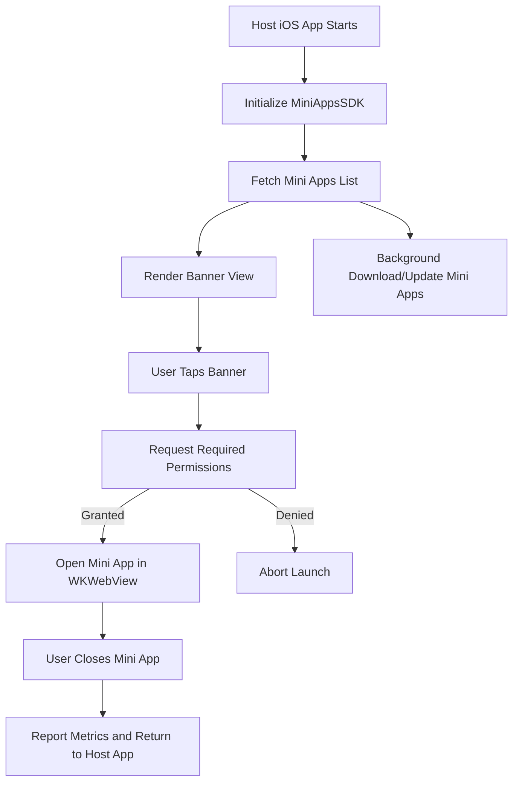
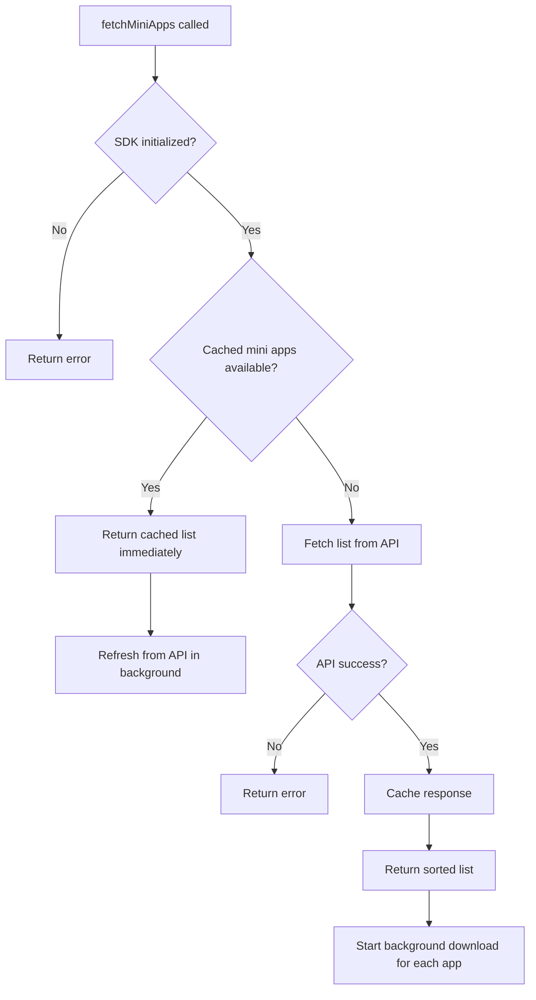
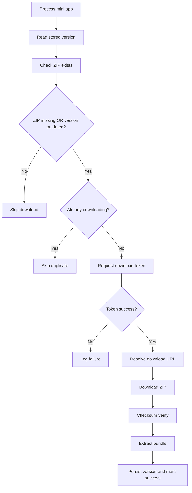
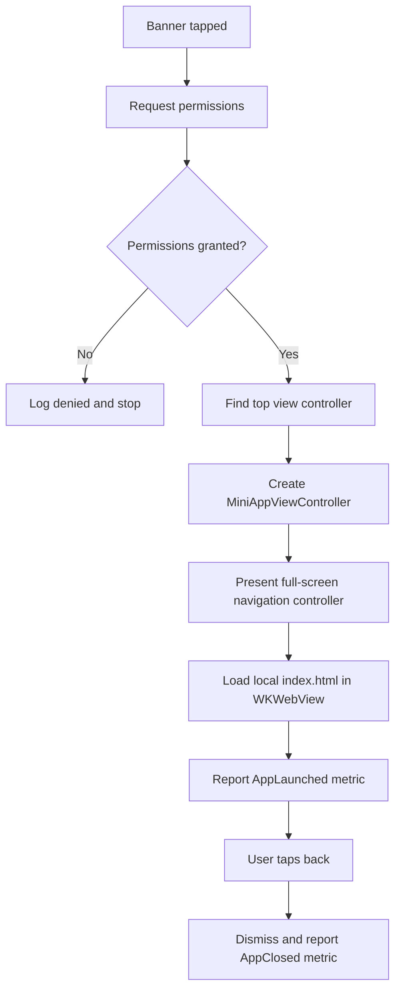
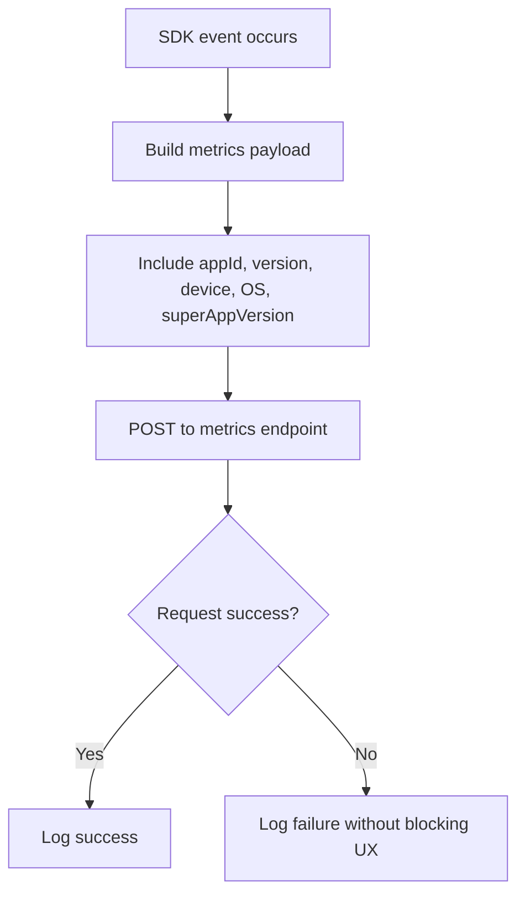

# MiniAppsSDK Flow Charts

## 1) High-Level End-to-End Flow

## 2) Fetch + Cache + Refresh Flow

## 3) Download and Version Decision Flow

## 4) Mini App Launch Flow

## 5) Metrics Reporting Flow

